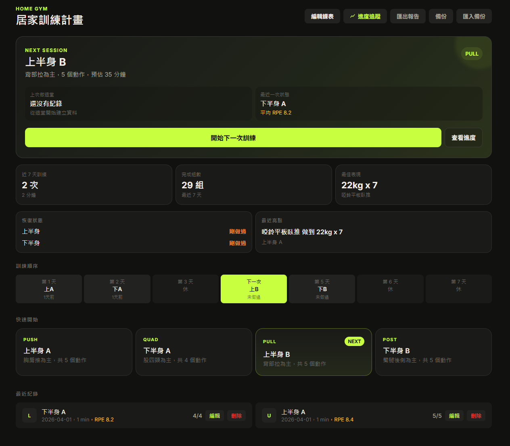
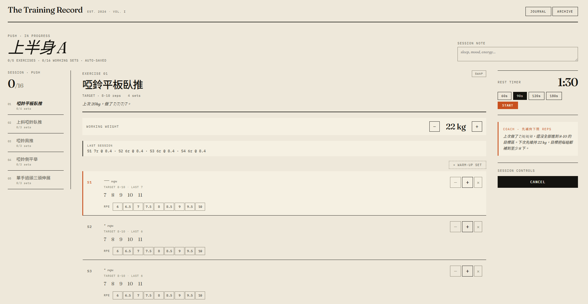
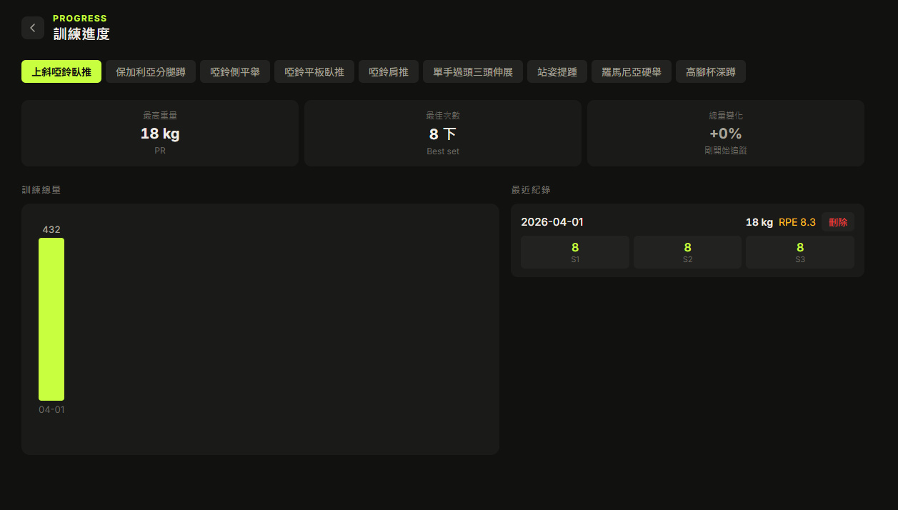

# Home Gym Coach

一個專為居家啞鈴訓練設計的離線紀錄工具，跑在本機瀏覽器，資料存在本機，不需要帳號或網路。





---

## 功能

- 4 天課表循環（上半身 A/B、下半身 A/B）
- 訓練中即時記錄每組次數與 RPE
- 自動建議下次重量（根據完成情況與 RPE）
- 進度追蹤圖表（每個動作的重量趨勢）
- 匯出訓練報告（Markdown 格式，可貼到 Notion/Obsidian）
- JSON 備份 / 匯入（換電腦或清資料時用）
- 完全離線，資料存在本機

---

## 安裝方式（Windows）

### 方法一：安裝版（建議）

至 [Releases](https://github.com/schumi4092/home-gym-coach/releases) 下載 `home-gym-coach-setup.exe`，雙擊執行，自動安裝並在桌面建立捷徑。

### 方法二：免安裝攜帶版

下載 `my-workout-portable` 資料夾，執行其中的 `open-workout.bat`。

> **Mac / Linux**：打包版（`.exe`）僅限 Windows。Mac/Linux 請用 `npm run dev`，功能完全相同，只是沒有桌面捷徑。

> **建議瀏覽器**：請使用 Chrome 或 Edge 開啟。Opera、Brave 等瀏覽器的安全政策可能導致頁面空白。

---

## 資料儲存

- 資料存在瀏覽器的 **localStorage**（`wk-hist-v5`、`wk-program-v1`）
- 一般清除瀏覽器快取通常不影響資料，但若清除站點資料、重灌系統、或換電腦，資料可能遺失
- 請定期使用右上角「備份」功能匯出 JSON

### 備份與還原

| 操作 | 說明 |
|------|------|
| **備份** | 右上角「備份」→ 下載 `home-gym-backup-日期.json` |
| **匯入備份** | 右上角「匯入備份」→ 選擇 JSON 檔案 → 自動還原訓練紀錄與課表 |
| **匯出報告** | 右上角「匯出報告」→ 複製 Markdown 到剪貼簿 |

---

## 技術說明

### window.storage

App 預設使用 `localStorage`，但若 `window.storage` 存在則優先使用它。這個介面是預留給未來整合原生儲存的擴充點，目前未使用，任何平台的資料都存在 `localStorage`，Mac/Linux 用 `npm run dev` 開啟也完全正常。

### 伺服器

`serve-workout.ps1` 是一個純 PowerShell 實作的輕量 HTTP 伺服器，監聽 `127.0.0.1:8765`。啟動時自動開啟瀏覽器，關閉 PowerShell 視窗即停止伺服器。若伺服器已在執行，再次點捷徑會直接開啟現有視窗。

---

## 課表說明

預設課表為 4 天分化，適合有一組啞鈴的居家訓練：

| 天數 | 課表 | 重點 |
|------|------|------|
| 第 1 天 | 上半身 A | 胸肩推為主 |
| 第 2 天 | 下半身 A | 股四頭為主 |
| 第 3 天 | 休息 | |
| 第 4 天 | 上半身 B | 背部拉為主 |
| 第 5 天 | 下半身 B | 臀腿後側為主 |
| 第 6-7 天 | 休息 | |

課表可在「編輯課表」中自由修改動作、組數、次數範圍與重量。預設重量為初學者起始建議值，請依個人能力調整。

---

## Changelog

### v0.1.0
- JSON 備份 / 匯入功能
- 程式碼模組化拆分（components、views、utils、storage、constants）
- README 補充截圖、資料儲存說明、跨平台說明

### v0.0.1
- 首次發布：4 天課表、訓練記錄、RPE 追蹤、自動加重建議、進度圖表、Markdown 匯出、Windows 安裝檔

---

## 開發

```bash
npm install
npm run dev
```

### 打包

```bash
# 打包成攜帶版資料夾
powershell -File package-portable.ps1

# 打包成 .exe 安裝檔
powershell -File package-exe.ps1
```
